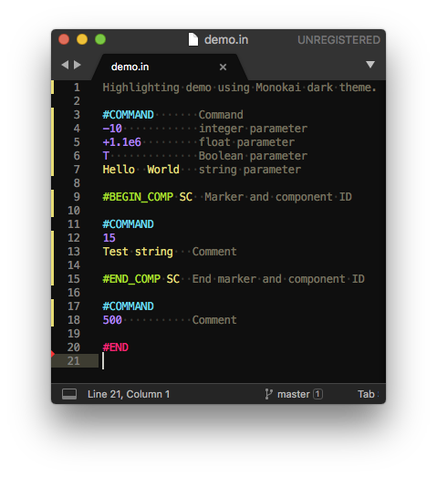

# Sublime-SWMF
Sublime 3 syntax highlighting for SWMF/BATSRUS configuration files. The rules are based on the [SWMF manual](http://csem.engin.umich.edu/tools/swmf/documentation/SWMF.pdf) section 3.2.2.

The file automatically highlights files ending in `.in` and `.IN` and it can also be set manually with the `View/Syntax/SWMF configuration` drop-down menu. 



## Installation
To install, clone this repository into the `Packages` folder inside Sublime.
```bash
cd my_sublime_folder/Packages
git clone git@github.com:svaberg/Sublime-SWMF.git
```
And try to open a `PARAM.in` file with Sublime. Sublime magic should take care of the rest.
